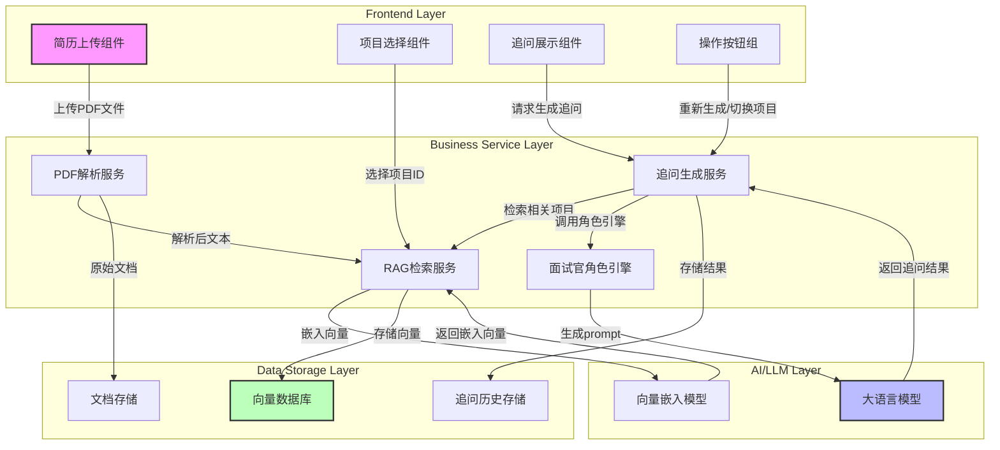
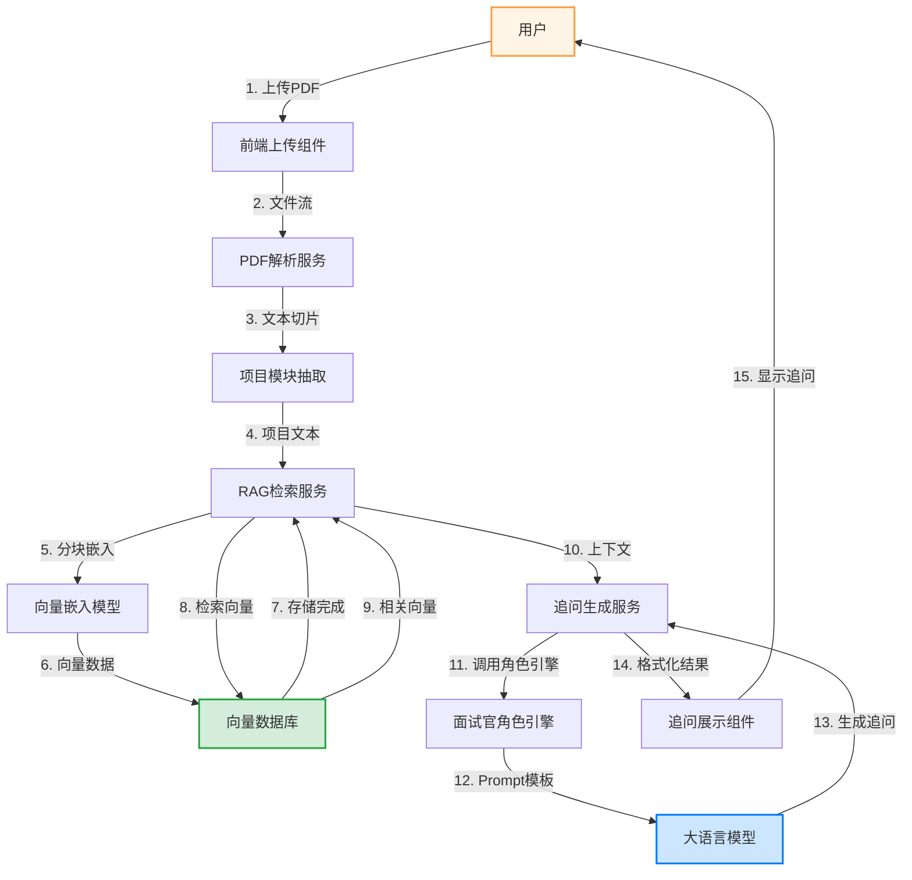

# 个人极简面试官（简历PDF项目刁钻追问）PRD

## 一、项目五要素

### 1. 目标用户
1. 求职应届生、实习求职者（互联网/通信/计算机/理工科为主）
2. 准备大厂面试、缺乏简历项目模拟面试的在校生
3. 想提前演练简历项目深挖追问、规避面试漏洞的个人求职者

### 2. 核心痛点
1. 自己写的简历项目只懂表面，**不知道面试官会从哪些角度刁钻深挖**
2. 无真人模拟面试官，没法针对性演练简历项目细节追问
3. 简历PDF信息零散，人工梳理项目亮点、漏洞耗时费力
4. 普通AI提问太基础，**没有大厂面试官刁钻、深挖、反问式提问逻辑**
5. 无法精准定位简历项目的技术盲区、逻辑漏洞、数据造假点

### 3. 核心功能
#### 功能1：简历PDF上传解析
- 支持本地上传简历PDF文件
- 基于基础RAG做文档切片、文本解析、内容向量化
- 自动抽取简历中**所有项目经历模块**，单独拆分隔离

#### 功能2：RAG知识库构建
- 对解析后的简历项目文本做分块嵌入
- 构建专属个人简历私有向量知识库
- 隔离无关信息（个人基本信息、教育经历、技能清单），只聚焦项目内容

#### 功能3：大厂面试官角色设定
- 固定扮演互联网大厂技术面试官风格：刁钻、深挖、抠细节、反问质疑、抓技术漏洞
- 提问逻辑贴合真实面试：技术原理、实现细节、难点坑点、优化方案、责任边界、数据真实性

#### 功能4：自动生成3个项目刁钻追问
- 基于RAG检索简历项目核心信息
- 针对**单个重点项目**精准生成3条高难度追问
- 提问不流于表面，直击项目薄弱点、技术盲区、模糊表述处
- 输出格式：面试官口吻逐条列出3个刁钻问题，附带简要追问逻辑

#### 功能5：轻量化结果展示
- 页面直接展示解析出的简历项目 + 3条刁钻追问
- 支持重新上传、重新生成追问、切换不同项目生成追问

### 4. 数据模型
#### （1）简历文档数据模型
```text
简历PDF源文件
├── 基础信息：姓名、学校、学历、求职岗位
├── 教育经历：院校、专业、时间
├── 技能标签：编程语言、框架、工具、专业能力
└── 项目经历列表[{
    项目名称
    项目时间
    项目职责
    技术栈
    项目成果/数据
    项目描述原文
}]
```

## 二、系统架构图



### 架构说明

| 层级 | 职责 | 关键模块 |
|------|------|----------|
| **前端层** | UI交互展示 | 简历上传、项目选择、追问展示 |
| **业务服务层** | 核心业务逻辑 | PDF解析、RAG检索、追问生成、角色引擎 |
| **AI/LLM层** | 模型调用 | 大语言模型、向量嵌入模型 |
| **数据存储层** | 数据持久化 | 向量数据库、文档存储、追问历史 |

### 架构自检

| 检查项 | 状态 | 说明 |
|--------|------|------|
| 分层结构 | ✅ | 4层清晰分离 |
| 越级调用 | ✅ | 无，遵循分层调用原则 |
| AI调用方式 | ✅ | 同步调用，交互式场景需即时响应 |
| 数据流方向 | ✅ | 箭头均标注数据流向 |

## 三、核心数据流图

### 主链路：上传简历→生成刁钻追问



### 数据流说明

| 步骤 | 环节 | 数据内容 | 说明 |
|------|------|----------|------|
| 1-2 | 前端→服务 | PDF文件流 | 用户上传简历文件 |
| 3-4 | 解析服务 | 项目文本切片 | 抽取项目经历模块 |
| 5-7 | RAG→嵌入→存储 | 向量数据 | 构建个人知识库 |
| 8-10 | 检索→上下文 | 相关项目内容 | 获取检索结果 |
| 11-13 | 角色引擎→LLM | Prompt+回复 | 生成刁钻追问 |
| 14-15 | 服务→前端 | 格式化结果 | 展示给用户 |

### 四个核心环节

1. **文件解析环节**：PDF文件 → 文本提取 → 项目模块拆分
2. **RAG检索环节**：文本分块 → 向量嵌入 → 向量存储 → 相似性检索
3. **追问生成环节**：上下文组装 → Prompt构建 → LLM调用 → 结果格式化
4. **结果展示环节**：数据返回 → UI渲染 → 用户交互

## 四、ADR-1：AI追问生成采用同步调用

### 背景
本系统核心功能是基于用户简历项目生成刁钻追问，属于交互式场景。用户上传简历后期望立即获得追问结果，用于面试准备演练。

### 选项
| 方案 | 描述 |
|------|------|
| **方案A：同步调用** | 用户发起请求后等待LLM响应，响应完成后直接返回结果 |
| **方案B：异步调用** | 用户发起请求后立即返回任务ID，后台异步处理，用户需轮询或等待推送通知 |

### 决策
选择 **方案A：同步调用**

### 理由
1. **用户体验优先**：交互式场景需要即时反馈，用户上传简历后期望立即看到追问结果
2. **流程简洁**：同步调用无需额外的任务状态管理、轮询机制和通知系统
3. **单次调用耗时可控**：生成3条追问的LLM调用通常在5-15秒内完成，在可接受的用户等待范围内
4. **实现复杂度低**：减少后端异步任务队列、状态存储等组件

### 代价
1. **响应时间较长**：用户需等待5-15秒才能看到结果，可能影响部分用户体验
2. **并发限制**：同步调用会占用连接资源，高并发场景下需要更多服务器资源
3. **超时风险**：若LLM服务响应延迟过高，可能导致请求超时
4. **重试机制复杂**：失败时需前端重试，不如异步任务的重试机制完善

## 四、ADR-2：LLM API调用采用Timeout + 降级方案

### 背景
系统核心依赖外部大模型API生成刁钻追问，但大模型API存在响应不稳定、偶尔超时、限流等问题。真实用户场景下，API故障会导致整个系统不可用，严重影响用户体验。需要建立韧性保护机制，确保系统在外部依赖故障时仍能正常运行。

### 选项
| 方案 | 描述 |
|------|------|
| **方案A：Timeout + 降级** | 设置合理超时时间，失败时使用预设问题库返回 |
| **方案B：仅超时无降级** | 设置超时时间，但超时后直接返回错误给用户 |
| **方案C：无限重试** | 失败时不断重试直到成功 |

### 决策
选择 **方案A：Timeout + 降级**

### 理由
1. **用户体验保障**：即使LLM API故障，用户仍能获得预设的高质量追问问题
2. **系统稳定性**：避免因外部依赖故障导致整个系统不可用
3. **超时时间合理**：设置20秒超时（大模型生成3条追问通常需5-15秒），平衡响应速度和成功率
4. **降级问题库分类**：根据技术栈（前端/后端/通用）提供针对性问题，保证降级质量

### 代价
1. **降级问题不够个性化**：预设问题无法针对具体项目描述生成，可能不够精准
2. **额外维护成本**：需要持续维护和更新预设问题库
3. **用户感知差异**：降级时用户可能感觉问题质量有所下降
