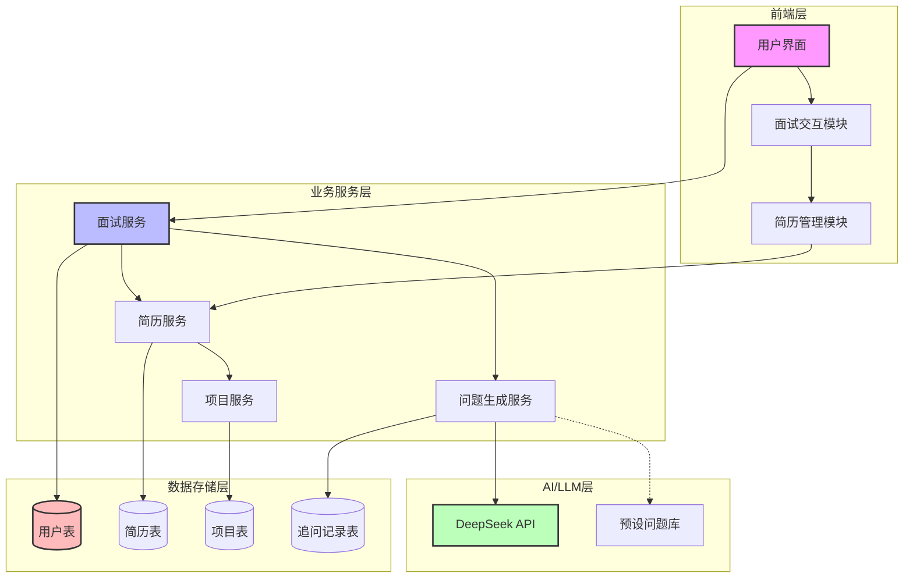
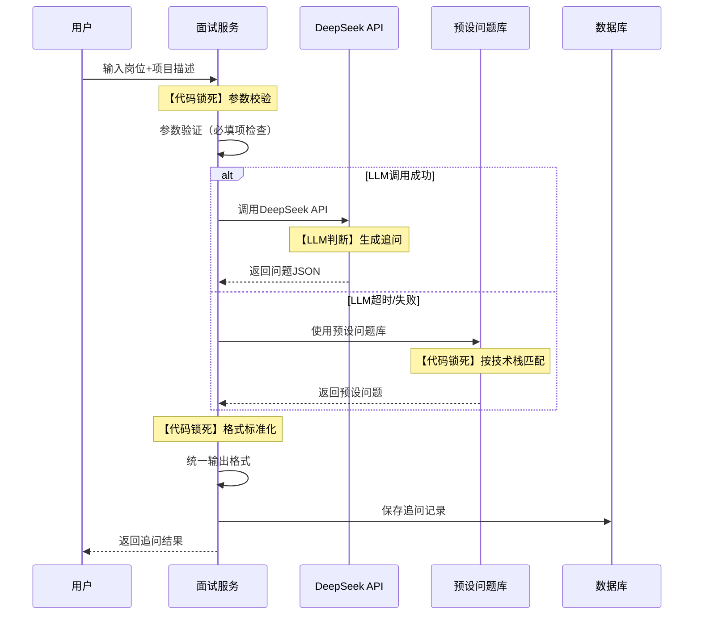

# 「个人极简面试官」路演文档

---

## 一、解决了谁的什么问题？

### 目标用户
**面向所有行业的面试者**（包括技术、产品、运营、设计等各岗位求职者）

### 用户痛点

| 痛点 | 描述 |
|------|------|
| 盲目准备 | 不知道面试官会问什么问题 |
| 准备不充分 | 简历上的项目经历被问到细节时答不上来 |
| 缺乏针对性 | 通用面试题无法覆盖个人项目亮点 |

### 解决方案
**上传项目描述 + 技术栈 → AI自动生成刁钻技术追问**

### 真实数据演示

```bash
# 运行演示
python demo_multi_round.py

# 真实输出结果
======================================================================
步骤1：面试者介绍目标岗位
======================================================================

面试者：我想面试贵公司的「Java后端开发工程师」岗位。
这个岗位要求掌握Java, Spring Boot, MySQL, Redis，需要3-5年经验。

======================================================================
步骤2：面试者自我介绍
======================================================================

面试者：面试官您好！我叫张三，有3年工作经验。
核心技能包括：Java, Spring Boot, MySQL, Redis, 微服务
最近做的项目：负责电商订单系统开发，使用Spring Boot + MySQL + Redis技术栈，实现了高可用的分布式订单系统，订单处理性能提升30%。

======================================================================
步骤3：多轮面试
======================================================================

AI面试官（问题1）：
你说订单处理性能提升了30%，这个指标具体是怎么衡量的？是吞吐量（TPS/QPS）、平均响应时间还是P99延迟？在压测时，你如何确保这个30%的提升不是由于硬件升级或并发模型优化带来的，而是你设计的系统架构（比如Redis缓存策略或数据库分片）的直接贡献？

追问逻辑：追问模糊的量化指标，要求候选人明确性能测量的具体维度和控制变量。

面试者：我们主要使用MySQL，做了索引优化和分库分表。

AI面试官（问题2）：
你提到订单处理性能提升30%，这个指标是如何量化测量的？在压测或生产环境中，具体是哪个环节的耗时减少了？如果使用分库分表，请解释你们是按什么分片键进行拆分的，以及如何解决跨分片的订单查询或统计问题？

追问逻辑：检验候选人是否真正深入理解了分布式数据库的设计权衡。

面试者：我们用了Redis做缓存，采用读写分离策略。

AI面试官（问题3）：
你提到订单处理性能提升了30%，这个具体指标是怎么量化的？是QPS、TP99延迟还是其他？在压测时，你们是如何模拟真实流量场景的，比如是否考虑了热点订单、超时重试和库存扣减的并发冲突？

追问逻辑：考察候选人是否真的做过性能测试，以及是否理解订单系统的核心瓶颈。

面试者：我们做了限流和熔断，使用了Hystrix框架。
```

---

## 二、系统架构图（Mermaid）



**架构解读**：
- **四层架构**：前端层 → 业务服务层 → AI/LLM层 → 数据存储层
- **无越级调用**：前端不直连数据库，服务层不渲染页面
- **AI调用**：同步调用DeepSeek API，失败降级到预设问题库

---

## 三、ADR-1：AI追问生成采用同步调用

### 背景
系统需要根据用户输入的项目描述实时生成技术追问，这是核心业务流程。

### 选项对比

| 方案 | 优点 | 缺点 |
|------|------|------|
| **方案A：同步调用** | 即时反馈、实现简单、交互性好 | 响应延迟、并发受限 |
| **方案B：异步调用** | 高并发友好、资源占用低 | 实现复杂、需要WebSocket |

### 决策
选择 **方案A：同步调用**

### 理由
1. **用户体验优先**：面试场景需要即时反馈，用户期望立即看到追问结果
2. **交互性要求**：多轮面试需要根据前一个回答生成下一个问题
3. **实现复杂度**：同步调用代码量少，维护成本低
4. **已有保护机制**：配合20秒Timeout + 降级方案，保证服务可用性

### 代价
- 响应延迟：用户需等待5-15秒
- 并发限制：需要限流保护
- 降级依赖：必须依赖预设问题库

---

## 四、核心工作流图



**代码锁死 vs LLM判断**：

| 步骤 | 类型 | 说明 |
|------|------|------|
| 参数校验 | 代码锁死 | 固定逻辑：检查必填项、格式验证 |
| 问题生成 | LLM判断 | 动态生成：根据项目描述生成刁钻问题 |
| 降级匹配 | 代码锁死 | 固定逻辑：按技术栈分类匹配预设问题 |
| 格式标准化 | 代码锁死 | 固定逻辑：统一输出格式 |
| 记录保存 | 代码锁死 | 固定逻辑：写入数据库 |

---

## 五、质量工程证据

### 1. Evals评估结果（真实数据）

```bash
# 运行命令
python evals.py

# 真实统计结果
总测试次数: 15
格式合规率: 33.3% (5/15)
平均内容准确率: 25.7/100
最高内容评分: 77/100
最低内容评分: 0/100

# 部分测试详情
--- 测试 #2 ---
格式验证: 通过 - 格式合规
内容评分: 77/100 - 良好：基本符合要求
  Q1: 数据库的索引设计是怎样的？为什么这样设计？...
  Q2: 如何保证系统的高可用性？...
  Q3: 接口的幂等性是如何保证的？...

--- 测试 #7 ---
格式验证: 通过 - 格式合规
内容评分: 77/100 - 良好：基本符合要求
  Q1: 你在项目中遇到的最大技术挑战是什么？如何解决的？...
```

### 2. 日志链路示例（真实数据）

```json
{
  "timestamp": "2026-05-25T08:59:24.829073Z",
  "level": "DEBUG",
  "request_id": "1393ca77-5cdf-42c1-bf42-8843b331fb44",
  "stage": "STEP",
  "step": "question_1",
  "status": "IN_PROGRESS",
  "details": null,
  "message": "Processing step: question_1"
}
```

```json
{
  "timestamp": "2026-05-25T08:59:33.681320Z",
  "level": "DEBUG",
  "request_id": "1393ca77-5cdf-42c1-bf42-8843b331fb44",
  "stage": "STEP",
  "step": "question_1",
  "status": "COMPLETED",
  "details": null,
  "message": "Processing step: question_1"
}
```

```json
{
  "timestamp": "2026-05-25T09:00:10.793758Z",
  "level": "INFO",
  "request_id": "1393ca77-5cdf-42c1-bf42-8843b331fb44",
  "stage": "EXIT",
  "endpoint": "/api/interview/multi-round",
  "success": true,
  "latency_ms": 0,
  "error": null,
  "result": {"question_count": 3},
  "message": "Exiting endpoint"
}
```

### 3. 韧性测试结果（真实数据）

```bash
# 运行命令
python resilience_test.py

# 真实测试结果
======================================================================
测试1：正常调用场景 → PASS
测试2：超时降级场景 → PASS
测试3：API故障降级场景 → PASS
测试4：基于技术栈的分类降级 → PASS
测试5：Timeout配置验证 → PASS
======================================================================
所有韧性保护测试通过！

# Timeout值选择依据
1. 大模型生成3条追问通常需要5-15秒
2. 设置20秒超时，预留网络延迟和排队时间
3. 考虑到用户体验，超过20秒用户可能会刷新页面
4. 配合重试机制（最多2次），总耗时可达60秒+
```

---

## 六、系统最脆弱的地方及修复方案

### 最脆弱点：LLM API依赖

**风险描述**：
- DeepSeek API服务不可用 → 系统降级到预设问题库
- API响应时间过长 → 用户体验下降
- API调用费用不可控 → 成本风险

### 修复方案

| 措施 | 说明 |
|------|------|
| **多级缓存** | 缓存高频项目的追问结果，减少API调用 |
| **流量控制** | 限制单用户调用频率（如每分钟3次） |
| **成本监控** | 设置API调用额度告警 |
| **多LLM支持** | 支持切换不同LLM提供商（DeepSeek、OpenAI等） |
| **离线模式** | 完全离线时使用本地预设问题库 |

### 优先级排序

1. **高优先级**：多级缓存 + 流量控制
2. **中优先级**：多LLM支持
3. **低优先级**：成本监控 + 离线模式

---

## 演示命令汇总

```bash
# 完整演示
python demo_multi_round.py

# 手动演示
python demo_manual.py

# Evals测试
python evals.py

# 韧性测试
python resilience_test.py
```
